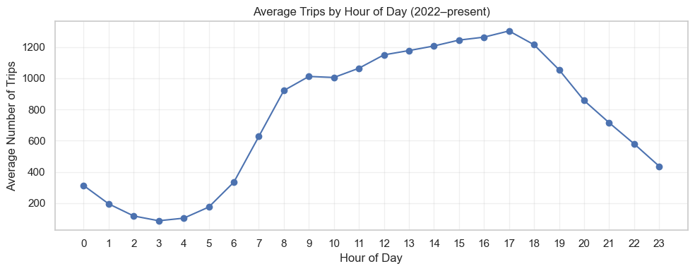
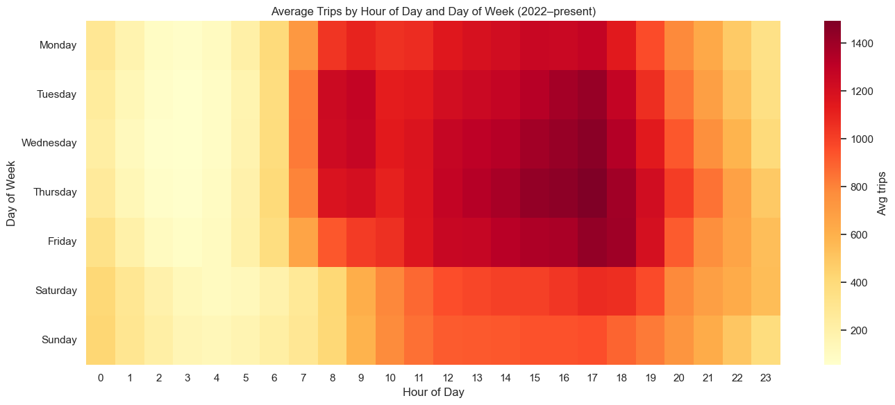
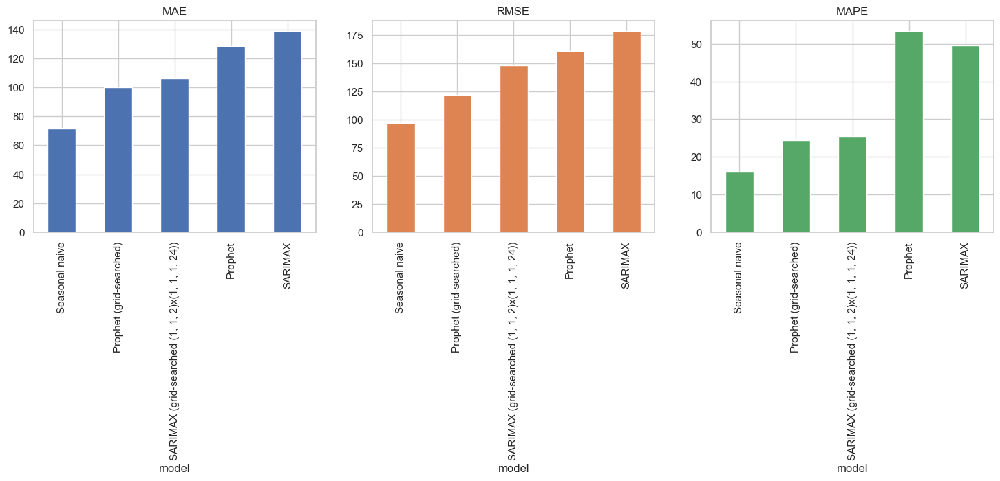
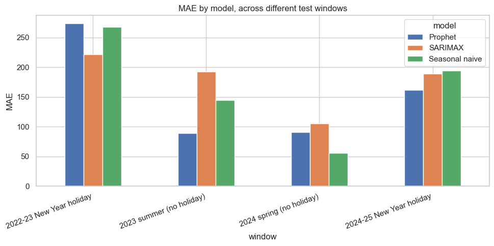

# Chicago Taxi Demand Forecasting (Post COVID, Hourly)

I originally built this project for a class, forecasting monthly taxi ride counts in Chicago. Knowing which month has the most rides is a fine forecasting exercise, but it is not something a driver or a company can really act on, so I expanded the project around a more specific goal: if the point is an insight someone can actually use, monthly totals are the wrong resolution, and hourly is where the useful answers live.

Separately, I also cut the pre COVID data out of this version. Ridership dropped so much during COVID that mixing that period in with normal years distorts the patterns rather than describing them, so everything here uses data from 2022 onward, after demand had settled back into something closer to normal.

## Why hourly instead of monthly

Monthly totals are fine for a class assignment but not that useful in practice. Telling a driver "Fridays are busier than Mondays" tells them something they probably already knew from experience. Hourly data lets you get much more specific: which hour, on which day, is actually worth driving.

## Data

Trip counts come from the City of Chicago's open data portal (Socrata), aggregated server side with SoQL queries rather than downloading raw trip level records (which would be tens of millions of rows). I pulled counts grouped by day and hour for 2022 through the present, treating 2022 onward as the "post COVID" window since that's roughly when the crash and initial recovery had settled into something more stable.

Raw and aggregated data lives in `data/`.

## What's in this repo

- `basic_eda.ipynb`: original class project EDA, kept for reference
- `hourly_demand_analysis.ipynb`: the actual work for this version — EDA, forecasting models, and the robustness check
- `models_monthly/`: the original monthly forecasting notebooks (ARIMA, SARIMA, Holt Winters, Prophet, naive) from the class project
- `data/`: daily, monthly, and hourly trip counts

## EDA: when is demand actually high

Averaging across all days, demand doesn't follow the classic two spike commuter pattern you'd expect (morning rush, evening rush). Instead there's one broad plateau from late morning through evening, peaking around 5pm. Overnight hours (1am to 5am) are dead regardless of the day.

Breaking it down by hour and day of week gives the more useful picture. The busiest block turns out to be weekday afternoons and evenings, Tuesday through Thursday specifically, not Friday night like you might assume.

## Forecasting

I compared three approaches on a held out two week test window:

- **Seasonal naive**: predict each hour using the value from exactly one week earlier. Simple, but it directly encodes the weekly pattern above.
- **Prophet**: handles daily, weekly, and yearly seasonality natively, tuned with a grid search over changepoint scale, seasonality mode, and Fourier order.
- **SARIMAX**: seasonal order set to the daily cycle (24 hours), with weekly seasonality handled through Fourier terms as exogenous regressors, since a seasonal period of 168 hours is too expensive to fit directly. Order chosen via grid search on a validation split.

On this single test window, seasonal naive won by a clear margin on every metric.

## Checking whether naive actually wins, or just got a favorable window

One test window isn't enough to conclude naive wins outright, so I reran the same comparison on four other two week windows spread across different points in the data, including two that cover the New Year holiday period.

Naive only won one of the four. Across more varied conditions it's a much closer contest, and the holiday windows are where the difference shows up clearly: actual demand drops well below the "normal" pattern over the holidays, and naive has no way to see that coming since it's just copying last week's value. Prophet, which has US holidays built in, tracked the dip noticeably better.

The conclusion, then: seasonal naive is a genuinely strong baseline during ordinary weeks, and it's hard to justify a more complex model if that's all you need. But it breaks down exactly where you'd expect it to, around holidays and other calendar anomalies it has no way to know about.

## What this means in practice

For an individual driver, the hour by day heatmap is a direct answer to "when should I actually be driving," and it corrects a real misconception (Friday night isn't it). The fact that naive performs so well in ordinary weeks is also good news for a driver, since it means a simple rule of thumb like "if it was busy this time last week, it'll probably be busy again" works about as well as anything more sophisticated, at least outside of holidays.

For a company running a fleet, this suggests a fairly practical strategy: don't invest in a heavier forecasting pipeline for routine weeks where a lookup table already does the job, but do lean on a model like Prophet specifically around known anomalies like holidays, where naive demonstrably falls apart. It's also worth noting SARIMAX kept underpredicting peak demand even after tuning, which matters more than it sounds like if that model were ever used to set staffing or surge thresholds. A model with a low average error isn't automatically the right choice if its errors are concentrated exactly where the business cares most, at the peaks.

## Limitations

The underlying data is citywide totals, with no zone or borough breakdown, so everything here is "when" and not "where." A version of this with location data would let the same kind of analysis answer which parts of the city are worth targeting at which hours, which is probably the more useful next step.

## Reproducing this

Main dependencies: pandas, numpy, matplotlib, seaborn, statsmodels, prophet. Run `hourly_demand_analysis.ipynb` top to bottom; the hyperparameter search cells for Prophet and SARIMAX take a while to run since they're fitting a lot of models, so budget time for those.
